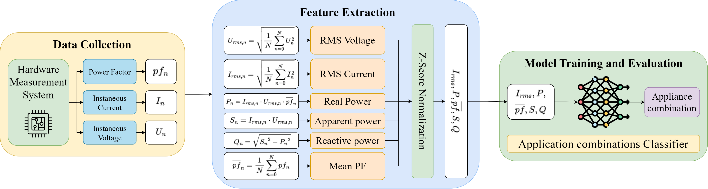

# CPFD: Robust NILM Classification with Deep Neural Networks

[](https://opensource.org/licenses/MIT)
[](https://www.python.org/downloads/)
[](https://pytorch.org/)

This repository contains the official implementation of **"CPFD: Robust NILM Classification with Deep Neural Networks Using Combinative Physical Features for Complex and Low-Power Devices."**

## 📋 Table of Contents

- [Overview](#overview)
- [Features](#features)
- [Installation](#installation)
- [Dataset](#dataset)
- [Project Structure](#project-structure)
- [Usage](#usage)
  - [Training MLP Models](#training-mlp-models)
  - [Training Sequence Models](#training-sequence-models)
  - [Model Evaluation](#model-evaluation)
- [Configuration](#configuration)
- [Results](#results)
- [Citation](#citation)
- [License](#license)
- [Contact](#contact)

## 🔍 Overview

Non-Intrusive Load Monitoring (NILM) enables appliance-level energy monitoring from aggregate power consumption data. This repository implements CPFD (Combinative Physical Features for Deep learning), a robust approach for NILM classification that combines multiple physical features with deep neural networks to accurately identify complex and low-power devices.



*Figure: End-to-end CPFD workflow from data collection and physical feature extraction to model training and appliance-combination classification.*

## ✨ Features

- **Multiple Model Architectures**:
  - Multi-Layer Perceptron (MLP) for tabular features
  - Time Series Classifiers (FCN, ResNet, Transformer) for sequential data
  - Ensemble methods (Random Forest, XGBoost)

- **Comprehensive Training Pipeline**:
  - K-fold cross-validation support
  - Hyperparameter optimization
  - TensorBoard logging
  - Model checkpointing and evaluation

- **Dataset Support**:
  - iAWE dataset
  - RAE dataset
  - VNDALE1 dataset
  - Easy integration for custom datasets

## 🚀 Installation

### Prerequisites

- Python 3.8 or higher
- CUDA-capable GPU (recommended for training)
- 8GB+ RAM

### Setup

1. **Clone the repository**:
   ```bash
   git clone https://github.com/myLab-UET/nilm_physical_feature.git
   cd nilm_physical_feature
   ```

2. **Create a virtual environment** (recommended):
   ```bash
   python -m venv venv
   source venv/bin/activate  # On Windows: venv\Scripts\activate
   ```

3. **Install dependencies**:
   ```bash
   pip install -r requirements.txt
   ```

4. **Configure environment**:
   Create a `.env` file in the root directory:
   ```bash
   # Example .env configuration
   PYTHONPATH=/path/to/nilm_physical_feature/src
   DATA_DIR=/path/to/datasets
   RESULT_DIR=/path/to/results
   ```

5. **Update configuration in `src/common/utils.py`**:
   ```python
   RESULT_DIR = "<your_result_directory>"
   DATA_DIR = "<your_data_directory>"
   ```

## 📊 Dataset

### Structure for CPFD model
- There will be multiple csv files, each csv file is associated with a particular label.
- For the raw data, please refer to DATA_DIR/raw_data.

```
DATA_DIR/cpfd_data
├── train
├──── 0_train.csv
├──── 1_train.csv
...
├── test
├──── 0_test.csv
├──── 1_test.csv
...
└── val
├──── 0_val.csv
├──── 1_val.csv
...
```

### Structure for sequence models

Datasets for sequence models should be organized in the following structure:

```
DATA_DIR/sequence_data
├── iawe/
│   ├── X_train.npy
│   ├── y_train.npy
│   ├── X_test.npy
│   └── y_test.npy
└── vndale1/
    ├── X_train.npy
    ├── y_train.npy
    ├── X_test.npy
    └── y_test.npy
```

### Download

The VNDALE1 dataset is publicly available at: [https://bit.ly/vndale1-dataset](https://bit.ly/vndale1-dataset)

For iAWE and RAE datasets, please refer to their respective publications:
- iAWE dataset: https://iawe.github.io/
- RAE dataset: https://dataverse.harvard.edu/dataset.xhtml?persistentId=doi%3A10.7910/DVN/ZJW4LC%2

## 📁 Project Structure

```
nilm_physical_feature/
├── src/
│   ├── common/                      # Shared utilities
│   │   ├── ann_models.py           # Neural network architectures
│   │   ├── model_eval.py           # Model evaluation utilities
│   │   ├── nilm_dao.py             # Data access objects
│   │   ├── nilm_pre_processing.py  # Data preprocessing
│   │   └── utils.py                # Common utilities
│   ├── model-training/
│   │   ├── mlp_train/              # MLP model training
│   │   │   ├── train_select_comb_ann.py
│   │   │   ├── train_k_fold_model.py
│   │   │   ├── eval_ann_model.py
│   │   │   ├── train_mlp.sh
│   │   │   └── eval_mlp.sh
│   │   ├── sequence_train/          # Sequence model training
│   │   │   ├── train_tsc.py
│   │   │   ├── clf_models.py
│   │   │   ├── clf_wrapper.py
│   │   │   ├── data_handler.py
│   │   │   └── training_tsc.yaml
│   │   └── sklearn_train/           # Sklearn-based models
│   │       ├── train_sklearn_models.py
│   │       └── train_sklearn_kfold_model.py
│   ├── microcontroller_deployment/  # Edge deployment code
│   └── others/                      # Additional utilities
├── results/                         # Training outputs
├── CPFD - Dataset Information and Hyperparameters.xlsx
├── requirements.txt
├── LICENSE
└── README.md
```

## 💻 Usage

### Training MLP Models

MLP models are designed for tabular feature data with combinative physical features.

```bash
cd src/model-training/mlp_train

# Train with specific configuration
python train_select_comb_ann.py \
    --numepochs 80 \
    --learning_rate 1.1e-3 \
    --weight_decay 1e-5 \
    --dropout_rate 0.2 \
    --window_size 1800 \
    --train_size 0.6 \
    --is_norm true

# Train with K-fold cross-validation
python train_k_fold_model.py \
    --dataset vndale1 \
    --k_fold 5 \
    --numepochs 80

# Or use the provided shell script
bash train_mlp.sh
```

### Training Sequence Models

Sequence models (FCN, ResNet, Transformer, LSTM) are designed for time-series data.

```bash
cd src/model-training/sequence_train

# Train a specific classifier
python train_tsc.py \
    --dataset_name iawe \
    --clf_name fcn \
    --data_ratio 1.0 \
    --gpu 0 \
    --num_workers 4

# Available classifiers: fcn, resnet, transformer, lstm
```

**Supported datasets**: `iawe`, `vndale1`, `rae`

**Training configurations** are defined in `training_tsc.yaml` for each dataset and model combination.

### Model Evaluation

```bash
cd src/model-training/mlp_train

# Evaluate a trained model
python eval_ann_model.py \
    --dataset vndale1 \
    --model_name "mlp_['Irms', 'P', 'MeanPF', 'S', 'Q'].pt"

# Or use the evaluation script
bash eval_mlp.sh
```

### Training Sklearn Models

```bash
cd src/model-training/sklearn_train

# Train Random Forest and XGBoost models
python train_sklearn_models.py --dataset iawe

# Train with K-fold cross-validation
bash train_sklearn_kfold.sh
```

## ⚙️ Configuration

### Hyperparameters

Model hyperparameters and dataset information are documented in:
- **Excel file**: `CPFD - Dataset Information and Hyperparameters.xlsx`
- **YAML config**: `src/model-training/sequence_train/training_tsc.yaml`

### Key Configuration Files

- `src/common/utils.py`: Global paths and random seed
- `.env`: Environment variables (PYTHONPATH, DATA_DIR, RESULT_DIR)
- `training_tsc.yaml`: Sequence model training configurations

## 📈 Results

Trained models and evaluation results are saved to the `results/` directory:

```
results/
├── models/              # Saved model checkpoints
│   ├── iawe/
│   ├── rae/
│   └── vndale1/
├── tensorboard/         # TensorBoard logs
├── visualization/       # Result visualizations
└── logs/               # Training logs
```

View training progress with TensorBoard:
```bash
tensorboard --logdir results/tensorboard
```

<!-- ## 📝 Citation

If you use this code or dataset in your research, please cite our paper:

```bibtex
@article{cpfd2025,
  title={CPFD: Robust NILM Classification with Deep Neural Networks Using Combinative Physical Features for Complex and Low-Power Devices},
  author={Your Name and Co-authors},
  journal={Journal Name},
  year={2025}
}
``` -->

## 📄 License

This project is licensed under the MIT License - see the [LICENSE](./LICENSE) file for details.

## 📧 Contact

For questions, issues, or collaboration inquiries:

- **Email**: thanhcong1.work@gmail.com
- **GitHub Issues**: [Create an issue](https://github.com/myLab-UET/nilm_physical_feature/issues)

## Acknowledgments

We acknowledge the contributors of the iAWE and RAE datasets, and thank the research community for their valuable feedback and support.

---

**Note**: This repository is actively maintained. For the latest updates, please check the [releases](https://github.com/myLab-UET/nilm_physical_feature/releases) page.